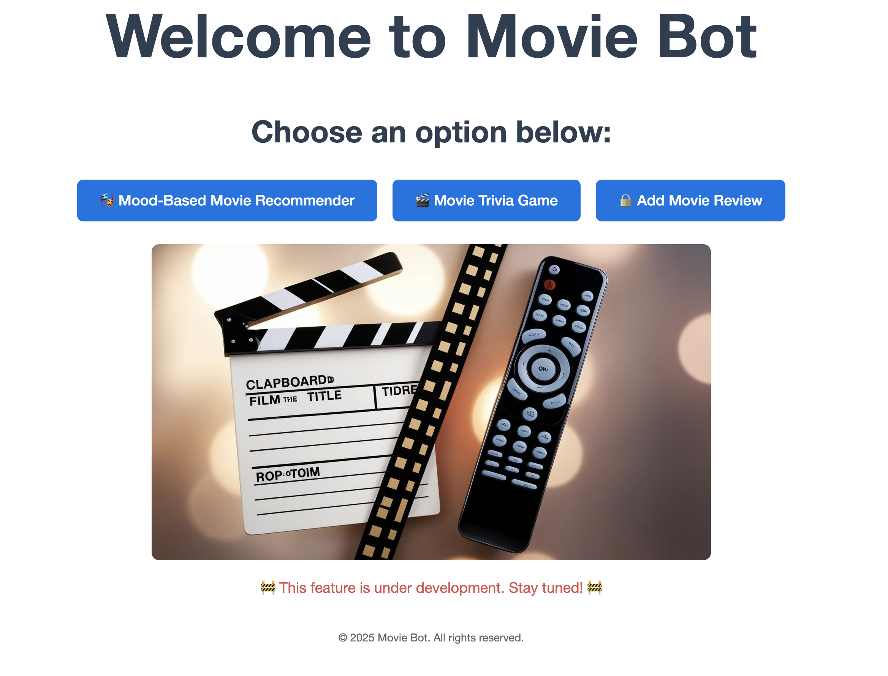

# Movie_Chatbot

##
Submission to: Dr. Jennifer Merritt

## 
Team Members:
  | Name         |      
|:------------:|
| Moyinoluwa Akin-Adamu    | 
| Niraj Gautam  | 
| Jinal Mehta  |  
| Pavleen Kaur  |  

## 

## 
This repository contains the final project for Class AI and Human Computer Interaction

## 
Please create an environment with the help of conda or pip install using requirements.txt

##
If you are interested only in running the application and not running the code in find_mood folder, 
then requirements.txt should be enough to fulfil the requriements to create the development environment,
else use extensive_requirements.txt

##
Upon cloning this repo and creating a development environment, please run python app.py while checking into the folder

##
This will spin up the development server and you shall be prompted to a link of the form http://127.0.0.1:5000/ which you can paste in your browser and interact with this application
